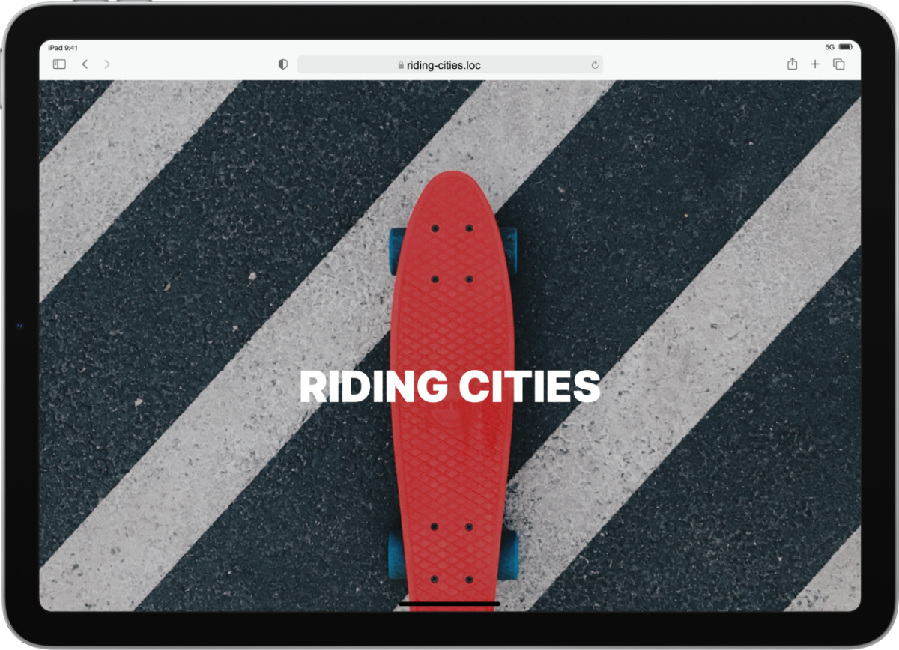

# Riding Cities

***
"<b>Client</b> : Riding Cities, association de skate*** 
***<b>Mission</b> : actualiser la page Internet de Riding Cities"
***

### 👨🏾‍💻 Modification de la section HTML

#### 1. Ajustement des colonnes
- La section du bas contient 4 colonnes tandis que la section "Les membres fondateurs" doit en contenir 3.
  - Supprimer une colonne pour n'en garder que trois.

#### 2. Modification des textes
- Les balises contenant du texte dans la nouvelle section diffèrent de celles de la maquette, remplacer le texte existant par le texte correspondant de la maquette.

#### 3. Ajout des images
- La section "La mission de l’asso" ne contient pas d'images, contrairement à la section "Les membres fondateurs" qui en nécessite.
  - Récupérer et ajouter les images dans les colonnes en renseignant correctement les attributs `src` (chemin relatif) et `alt` (description pertinente).

### Utilisation des classes CSS pour la mise en forme

#### 1. Modification des textes
- Les textes doivent avoir une couleur et un alignement spécifiques, tels que définis dans la maquette.
  - Trouver les classes CSS appropriées dans le code existant et appliquer ces classes aux éléments de texte concernés.

#### 2. Changement de la couleur de fond
- La couleur de fond de la section doit être modifiée.
  - Trouver la classe CSS correspondante et appliquer cette classe à la section pour changer la couleur de fond.

### Ajout d'une section et modification du bouton de téléchargement

#### 1. Ajout du titre et de la couleur de fond
- La nouvelle section nécessite un titre "Découvrez nos cours" et un fond gris.
  - Ajouter le titre en s'inspirant des autres titres présents sur la page et appliquer la classe CSS pour la couleur de fond grise.

#### 2. Modification du bouton de téléchargement
- Le bouton "Télécharger le planning de cours" doit être arrondi et de couleur spécifique, avec un effet au survol.
  - Appliquer les classes CSS nécessaires pour obtenir la forme arrondie et la couleur adéquate.
  - Ajouter la classe CSS pour l'effet au survol du bouton.

#### 3. Ajout du deuxième bouton de téléchargement
- La maquette montre deux boutons de téléchargement côte à côte.
  - Copier et coller la balise du bouton existant pour créer le second bouton.
  - Modifier la classe appliquée sur la `div` contenant les boutons pour les aligner en colonne.

#### 4. Finalisation de la modification des boutons
- Les textes et couleurs des boutons doivent correspondre à la maquette.
  - Modifier le contenu texte des boutons.
  - Appliquer les couleurs appropriées à chaque bouton en modifiant les classes correspondantes.

### Rattachement des documents de téléchargement

#### 1. Attribution des liens de téléchargement
- Les boutons doivent mener vers les plannings de cours pour enfants et pour adultes.
  - Récupérer les liens des brochures dans le dossier "Documents".
  - Remplir l’attribut `href` des boutons avec les liens appropriés.

Ces étapes permettent de structurer le travail de mise à jour de la page Internet en s'assurant que chaque tâche est accomplie de manière méthodique et ordonnée.

#### Voir le projet en ligne
🔗 [Riding Cities](https://jean-assoumani.github.io/riding-cities/)
***
Projet 2 - Premiers pas sur le language HTML - Openclassrooms 2024
***